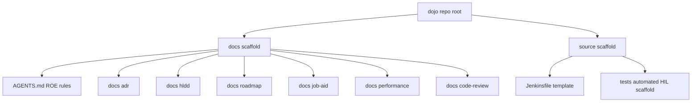

# Architecture

| Status | Date       | Project Version |
|--------|------------|-----------------|
| Draft  | 2026-07-11 | 0.0.1           |

## Overview

Dojo ships two independent scaffolds from one repo:

### docs scaffold

The rules a consuming project copies to get sequential ADR/HLDD/roadmap/job-aid/code-review
numbering, a consistent document heading format, and a Mermaid-only diagram policy — all defined
in `AGENTS.md` and elaborated in `CONTRIBUTING.md`. Every numbered subdirectory starts empty
(`.gitkeep` only) until a real project populates it.

### source scaffold

Working code, not documentation about code. Currently one scaffold exists:

- **`source/tests/automated/`** — a pytest-based embedded hardware-in-the-loop (HIL) test suite:
  SSH/serial transport helpers (`coms.py`), a static-config/runtime-state split
  (`test_parameters.py`/`session_state.py`), a blocker mechanism and step-narration fixtures
  (`conftest.py`), a dependency-light static HTML report fallback (`reporting.py`), fixture health
  checks (`pre_test.py`), and a worked example test file (`test_example_ssh.py`). See
  `docs/hldd/001-automated-test-scaffold.md` for the full component breakdown and
  `docs/adr/001-adopt-mos-docker-hil-test-suite-architecture.md` for why it exists and what was
  deliberately left out.
- **`source/Jenkinsfile`** — a template CI pipeline for the scaffold above, shipped with
  placeholder tokens (agent label, credential IDs, repo URL) rather than prose-only guidance.

## Validating this repo

`make r` (repo root) syncs the automated-test scaffold's uv-managed environment and runs its
non-hardware test suite — a smoke check that the scaffold itself is healthy, since this repo has
no physical target device attached to run the hardware-marked tests against.

## Where to look next

- Adding or changing an ROE rule: `CONTRIBUTING.md`
- Why the test scaffold is shaped the way it is:
  `docs/adr/001-adopt-mos-docker-hil-test-suite-architecture.md`
- The test scaffold's component-by-component design: `docs/hldd/001-automated-test-scaffold.md`
