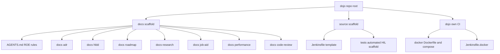

# Architecture

| Status | Date       | Project Version |
|--------|------------|-----------------|
| Draft  | 2026-07-11 | 0.0.1           |

## Overview

Dojo ships two independent scaffolds from one repo:



### docs scaffold

The rules a consuming project copies to get sequential ADR/HLDD/roadmap/research/job-aid/code-review
numbering, a consistent document heading format, and a Mermaid-only diagram policy — all defined
in `AGENTS.md` and elaborated in `CONTRIBUTING.md`. Every numbered subdirectory starts empty
(`.gitkeep` only) until a real project populates it.

### source scaffold

Working code, not documentation about code. Currently one scaffold exists:

- **`source/tests/automated/`** — a pytest-based embedded hardware-in-the-loop (HIL) test suite:
  SSH/serial transport helpers (`coms.py`), a static-config/runtime-state split
  (`test_parameters.py`/`session_state.py`), a blocker mechanism and step-narration fixtures
  (`conftest.py`), a dependency-light static HTML report fallback (`reporting.py`), fixture health
  checks (`pre_test.py`), and a worked example test file (`test_example_ssh.py`). See
  `docs/hldd/001-automated-test-scaffold.md` for the full component breakdown and
  `docs/adr/001-adopt-mos-docker-hil-test-suite-architecture.md` for why it exists and what was
  deliberately left out.
- **`source/Jenkinsfile`** — a template CI pipeline for the scaffold above, shipped with
  placeholder tokens (agent label, credential IDs, repo URL) rather than prose-only guidance.

## Validating this repo

`make r` (repo root) syncs the automated-test scaffold's uv-managed environment and runs its
non-hardware test suite — a smoke check that the scaffold itself is healthy, since this repo has
no physical target device attached to run the hardware-marked tests against.

The same command runs in a container, so the check starts from a machine that has never seen this
repo instead of a developer box with a warm `.venv`:

```
docker compose -f docker/docker-compose.yml build dojo-dev
docker compose -f docker/docker-compose.yml run --rm dojo-dev make r
```

`Jenkinsfile.docker` (repo root) is dojo's own CI pipeline and runs exactly those two commands on
the VEDA Jenkins controller as the `Dojo-Docker` job, publishing the resulting `junit.xml`. It is
**not** `source/Jenkinsfile`, which is the placeholder-laden HIL template consuming projects copy.
See `docs/adr/002-containerize-scaffold-validation.md`.

### Against another Python

The scaffold develops on the interpreter `source/tests/automated/.python-version` pins (3.14) and
supports `>=3.10`. Any other interpreter needs no edit anywhere — set `PYTHON_VERSION`:

```
PYTHON_VERSION=3.12 docker compose -f docker/docker-compose.yml build dojo-dev
PYTHON_VERSION=3.12 docker compose -f docker/docker-compose.yml run --rm dojo-dev make r
```

In CI the same thing is the `PYTHON_VERSIONS` build parameter: empty (the default) runs one cell on
the pinned interpreter, and `3.10,3.12,3.14` fans out one parallel cell each. Both paths verify the
interpreter that actually ran rather than the one requested — see
`docs/adr/003-python-version-baseline-and-matrix.md` for why that check exists.

## Where to look next

- Adding or changing an ROE rule: `CONTRIBUTING.md`
- Why the test scaffold is shaped the way it is:
  `docs/adr/001-adopt-mos-docker-hil-test-suite-architecture.md`
- The test scaffold's component-by-component design: `docs/hldd/001-automated-test-scaffold.md`
- Why dojo's own validation runs in a container:
  `docs/adr/002-containerize-scaffold-validation.md`
- Which Python versions are supported, and how to check another:
  `docs/adr/003-python-version-baseline-and-matrix.md`
