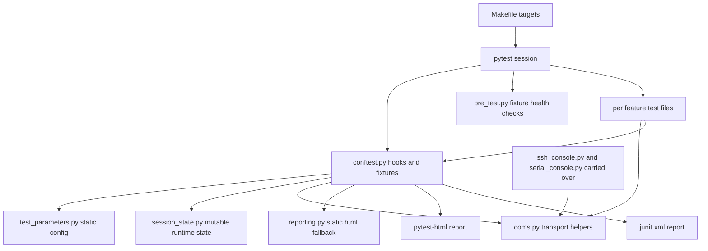
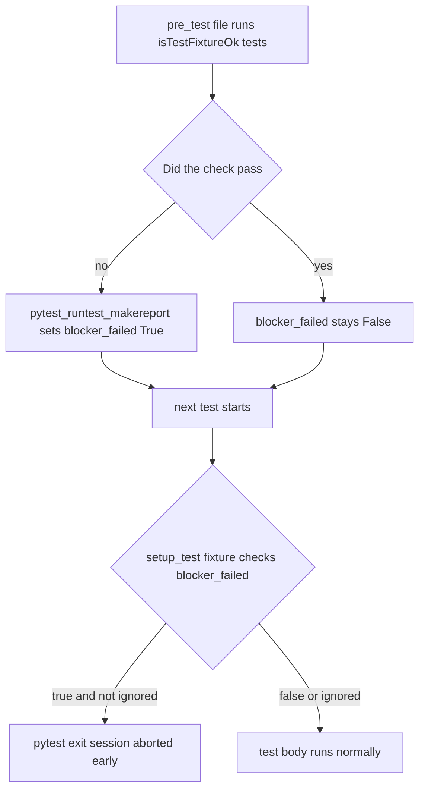

# ADR 001 — Adopt mos-docker's Automated Test Suite Architecture as the Dojo Test Scaffold

| Status   | Date       | Project Version |
|----------|------------|-----------------|
| Accepted | 2026-07-11 | 0.0.1           |

## Context

Dojo is a system-agnostic ROE template project. Its value today is the `docs/` scaffold
(`AGENTS.md` rules, numbered `docs/adr`, `docs/hldd`, `docs/roadmap`, `docs/job-aid`,
`docs/performance`, `docs/code-review`) that a new project copies as a starting point. `source/`
is the equivalent starting point for code and currently holds nothing but `.gitkeep` — there is no
starting point yet for a project that needs an automated test suite.

`mos-docker/tests/automated` is a mature pytest suite for Anaconda OS hardware-in-the-loop (HIL)
testing. It is on its 13th changelog cycle (`automated_test_version` 0.0.13) and has already paid
down real bugs a first draft of a test harness typically hits: a leaking SSH-connection counter, a
blocker mechanism that was wired up but never actually enforced, `--strict-markers` typos silently
collecting zero tests, JUnit XML silently dropping captured stdout, and a Jenkins CSP setting that
silently blocks the JS-rendered HTML report table. Its structure is not mos-docker-specific by
accident — `readme.md`'s "Adding a new test" section and the CHANGELOG's 0.0.4 "architecture pass"
entry show it was deliberately organized for exactly the kind of long-term, multi-contributor
maintenance dojo's own ROE cares about (traceability to ADRs, sequential changelog discipline,
explicit separation of static config from runtime state).

Rather than every future project rediscovering the same pitfalls, this ADR proposes extracting the
general-purpose *architecture* into `dojo/source` as a copyable base for future automated test
suites.

Dojo's test scaffold is specifically for **embedded systems testing** — SSH and serial are not one
transport option among many there, they are the near-universal way to reach an embedded target
(console UART for early-boot/bootloader visibility, SSH once the target's network stack is up).
That changes what counts as "mos-docker-specific" versus "general": the *mechanics* of SSH and
serial communication, and the console/debug tooling built on them, are exactly the kind of thing
every future embedded test suite will need on day one. What's actually Anaconda-OS-specific is the
*configuration* layered on top of those mechanics — private-net IP defaults, RAUC bundle handling,
cutiepi-shell references — not the transport code itself.

## Decision drivers

- Reuse proven structural patterns *and* the proven, already-hardened SSH/serial transport code —
  embedded HIL testing needs both on essentially every project, so stripping them back to a stub
  would just force every consumer to reimplement the same paramiko/pyserial handling mos-docker
  already debugged.
- Keep the scaffold agnostic to the specific *product* under test (no Anaconda OS, RAUC, or
  cutiepi-shell assumptions), while accepting SSH and serial as fixed, load-bearing parts of the
  embedded-testing domain dojo targets — per dojo's own ROE Project Philosophy ("system-agnostic"
  means agnostic across firmware/hardware projects, not transport-agnostic within them).
- Reduce the "blank file" cost for a new project's test suite to "copy `dojo/source`, point the
  transport helpers at the new target, fill in feature test files."

## Architecture analysis — mos-docker/tests/automated

The suite has ten distinct architectural elements worth separating from the Anaconda-OS-specific
code that implements them:

1. **uv-managed, pinned environment.** `pyproject.toml` splits runtime deps from a `dev` dependency
   group; `.python-version` plus `uv.lock` (both committed) make `uv sync --all-groups` fully
   reproducible. No separate pyenv setup needed.

2. **Static config versus runtime state, deliberately split into two files.**
   `test_parameters.py` holds only values mirrored from CLI options or fixed constants — read once,
   unchanged for the session. `session_state.py` holds only values that change *during* a run
   (`blocker_failed`, `ignore_blockers`, `test_marker_used`). Both files say explicitly, in their
   own docstrings, why the split exists. This is the single most-referenced convention in the
   suite's own CHANGELOG (0.0.4) and is fully system-agnostic.

3. **`conftest.py` as the single pytest-plugin hub**, composed of independent, individually
   justified pieces rather than one undifferentiated blob:
   - CLI option registration (`pytest_addoption`) paired 1:1 with session-scoped fixtures that
     mirror each option — a repeated, consistent pattern rather than five bespoke ones.
   - A connection-lifecycle fixture (`ssh_client`) that owns create/teardown so individual tests
     don't hand-roll `try`/`finally`. Generalizes to "resource fixture" for any transport.
   - A **blocker mechanism**: tests marked `isTestFixtureOk` that fail flip
     `session_state.blocker_failed` via `pytest_runtest_makereport`; an autouse fixture checks that
     flag and calls `pytest.exit()` before any further test runs. Fail-fast on infrastructure
     problems instead of letting every dependent test time out independently. Opt-out via
     `--ignore_test_blockers`.
   - A **narration fixture** (`step`) that writes to both the console and `record_property` in one
     call, feeding two independent report surfaces (JUnit `<system-out>`, and a custom expandable
     "Steps performed" block in the HTML report) from a single call site in test code.
   - `pytest_sessionstart`/`pytest_sessionfinish` for session-level bookkeeping (marker capture,
     opt-in hardware autodetection, end-of-run summary).
   - A layered set of `pytest_html_*` hooks (custom columns, custom title, custom summary text)
     that *extend* `pytest-html` rather than replacing it.

4. **A single "transport helpers" module** (`coms.py`) that every test calls into, instead of tests
   making raw library calls. Consistent create/free pairing, a "wait for exit code" variant, and a
   variant that deliberately tolerates a connection dying mid-command (`sshReboot`) — plus a
   generic polling `wait()` and retry-until-timeout helper. Tests read declaratively because the
   awkward edge cases live in one place.

5. **A standalone, dependency-light fallback-report module** (`reporting.py`). Pure stdlib, and its
   HTML-building function is a pure function (`build_static_report_html`) separated from the
   side-effecting `write_static_report`, so it is independently testable and reusable regardless of
   what CI system is in front of it. Exists because pytest-html's JS-rendered table was silently
   blocked by a Jenkins CSP setting — a real failure mode, not speculative.

6. **One test file per feature area, not per chance**, each traceable to the decision it
   verifies (readme.md: "each `test_*.py` file covers one feature or ADR"). Module-level
   `pytestmark = pytest.mark.hardware` instead of decorating every individual test. A registered,
   `--strict-markers`-enforced marker vocabulary in `pyproject.toml` so a typo'd `-m` selector fails
   loudly instead of silently collecting zero tests.

7. **A "fixture health check" file** (`pre_test.py`), run first and marked `isTestFixtureOk`:
   verifies the test *environment* itself (importable dependencies, interpreter version, target
   reachability) before any feature test burns time failing for an infrastructure reason.

8. **Structural traceability, not just convention.** `pre_test.py::test_changelog_version_matches`
   fails the run if `test_parameters.automated_test_version` and `CHANGELOG.md`'s newest heading
   disagree — a real, enforced check, not a comment asking nicely. Every non-trivial test module's
   docstring cites the decision record it verifies.

9. **Interactive console scripts reuse the same transport module.** `ssh_console.py` and
   `serial_console.py` are not part of the pytest suite; they are human-facing debug entry points
   built on the exact same `coms.py` primitives the automated tests use, plus a hardware
   autodetection helper (`usb_test.py`) keyed on USB serial numbers.

10. **The Makefile as the one command surface CI and local dev share.** Short, memorable targets
    (`sync`, `test`, `swtest`, `smoke`, `fixture`, `report`, `serial`, `ssh`, `clean`), auto-detects
    `uv` versus bare `python`, centralizes output paths and a default credential fallback.
    `Jenkinsfile.hil` calls the same underlying commands as pipeline stages rather than duplicating
    them, and separately gates a fixture-health stage ahead of feature stages and publishes
    `junit.xml` via Jenkins' native `junit` step (the HTML report alone was insufficient — see
    element 5 above).

## Decision

Adopt all ten elements above into `dojo/source/tests/automated/` (the concrete, final path — not
"or equivalent"), split into three treatments:

- **Structure and mechanics carried over as working code**: the uv/pyproject setup, `.gitignore`,
  the config/state split, `conftest.py` in full, `coms.py`'s SSH and serial primitives,
  `reporting.py`, `pre_test.py`, the console scripts (`ssh_console.py`/`serial_console.py`),
  `usb_test.py`'s autodetection helper, and the Makefile (including `serial`/`ssh` targets). A
  template `Jenkinsfile` (no `.hil` suffix — the scaffold starts with one pipeline, not several
  purpose-suffixed ones like mos-docker's) ships at the scaffold root. One example feature test
  file, `test_example_ssh.py`, ships alongside `pre_test.py` so the "one file per feature,
  module-level `pytestmark`, `ssh_client` + `step` fixtures" pattern (element 6) exists as working
  code a consumer can copy, not just prose in `readme.md`.
- **Product-specific values genericized**: private-net IP defaults; the `MOS_SSH_PASSWORD` env var
  (renamed `DOJO_SSH_PASSWORD`, with no baked-in default password — see mapping table); the
  pytest-html/static-report title (currently hardcoded independently as `"Anaconda OS HIL Test
  Report"` in both `conftest.py` and `reporting.py` — becomes a single `test_parameters.py`
  constant, `"Embedded HIL Test Report"`, read by both); `pyproject.toml`'s package name; and
  `readme.md`'s project-specific comparisons (e.g. the "wingman project" reference) — all replaced
  with generic text or placeholders.
- **Dropped entirely, no generic analog**: `main.py` (a pytest-feature demo unrelated to the
  architecture pattern — `test_example_ssh.py` demonstrates the real pattern instead),
  `test_cutiepi_shell_build_contract.py` and `test_cutiepi_shell_runtime_contract.py` (read Yocto
  recipe files and one specific app's source — nothing to generalize), RAUC bundle handling
  (`test_system_update.py`'s pattern, the `systemUpdate` marker), and the Jenkinsfile's RAUC OTA
  stage plus the OTA-build-lookup portion of its Attestation stage (`Build_Coachwhip` API calls).
  The Attestation stage's generic part — identifying who triggered a build via Jenkins' Cause
  API — is kept, since that's useful on any project.

| mos-docker/tests/automated element | Dojo treatment |
|---|---|
| `pyproject.toml` (uv, dependency groups, `--strict-markers`, `junit_logging`) | Carried over structurally and by dependency: `paramiko`, `pyserial`, `scp` are kept (SSH/serial are core to embedded testing), dev group (`pytest`, `pytest-html`, `pytest-order`, `pytest-timeout`) kept; `name` field becomes `dojo-automated-tests` (a consuming project renames it again to its own) |
| `.python-version` / `uv.lock` | Carried over as the reproducibility pattern; regenerated against dojo's actual dependency set |
| `.gitignore` | Carried over unmodified (`.venv`, `output/`, `.pytest_cache`, `__pycache__` patterns) |
| `test_parameters.py` / `session_state.py` split | Carried over verbatim as a pattern; Anaconda-OS-specific defaults (`target_host`, `target_user` values) replaced with placeholders, the fields themselves kept since target host/user are universal; gains a new `report_title` constant (see report-title row below) |
| `conftest.py` (option-mirror fixtures, blocker mechanism, `step` fixture, pytest-html hooks) | Carried over in full, including `ssh_client` and `my_serial_port` — both are generic embedded-testing fixtures, not Anaconda-OS-specific; `pytest_html_report_title` reads `test_parameters.report_title` instead of a hardcoded string |
| `coms.py` | **Carried over as working code, name unchanged.** SSH (paramiko), SCP upload, serial monitor, ping-with-retry, and the generic `wait()` poller all stay; only Anaconda-OS-specific helpers (RAUC slot parsing, `extract_startup_failure_lines`'s Anaconda-specific log patterns) are stripped or moved into an example test rather than the shared module. Keeping the name (not renaming to e.g. `transport.py`) minimizes diff friction against mos-docker's file when hand-porting future fixes into the scaffold. |
| `MOS_SSH_PASSWORD` env var (`coms.py`, `Makefile`, `readme.md`) | Renamed `DOJO_SSH_PASSWORD`. The Makefile's `export MOS_SSH_PASSWORD ?= ppp` default (a real product's shipped credential) is **not** carried over — `DOJO_SSH_PASSWORD` ships unset, so a missing password fails the SSH connection loudly instead of a template silently embedding a real device's default password |
| Report title string (`"Anaconda OS HIL Test Report"`, hardcoded separately in `conftest.py` and `reporting.py`) | Deduplicated into one `test_parameters.report_title = "Embedded HIL Test Report"` constant, imported by both call sites instead of hardcoded twice |
| `reporting.py` | Carried over verbatim apart from the report-title fix above — otherwise already fully system-agnostic |
| `pre_test.py` (`isTestFixtureOk`, changelog-version check) | Carried over as a pattern with a generic fixture-health example test (import check, python version, target reachability) |
| `main.py` (pytest-feature demo) | **Not carried over.** It demonstrates generic pytest features (markers, xfail, skip) unrelated to this suite's architecture; `test_example_ssh.py` (new, see below) demonstrates the real pattern with working code instead |
| `test_cutiepi_shell_build_contract.py` / `test_cutiepi_shell_runtime_contract.py` | **Not carried over.** Both read Yocto recipe files and one specific app's source tree — entirely Anaconda-OS/cutiepi-shell-specific, no generic analog |
| `test_ssh.py` | Becomes `test_example_ssh.py` (new file, not a copy): a minimal SSH-reachability test using `ssh_client` and `step`, module-level `pytestmark = pytest.mark.hardware` — the working example of the "one file per feature" pattern (element 6) that the scaffold otherwise only describes in prose |
| Marker vocabulary (`hardware`, `smokeTest`, `systemUpdate`, `isTestFixtureOk`) | `isTestFixtureOk`, `smokeTest`, and `hardware` kept as generic (hardware-in-the-loop testing is dojo's whole domain); `systemUpdate` dropped as RAUC/Anaconda-OS-specific, documented as an example of a project-specific marker to add |
| Makefile targets | Carried over in full, including `serial`/`ssh` — both are generic embedded-debug entry points, not tied to Anaconda OS; `MOS_SSH_PASSWORD` references become `DOJO_SSH_PASSWORD` per the row above |
| `readme.md` "Adding a new test" section | Carried over near-verbatim — the conventions it documents are exactly the ones being adopted here; the "wingman project" comparison is dropped, keeping only the project-agnostic reasoning (`tests/output/` as a sibling directory) |
| `CHANGELOG.md` + version-sync test | Carried over as a pattern, seeded with a `0.0.1` entry |
| `ssh_console.py` / `serial_console.py` | Carried over as working code; the specific service tailed (`cutiepi-shell.service`) becomes a placeholder/example, the live-tail pattern itself stays |
| `usb_test.py` | Carried over as working code; `known_hardware` ships as an empty dict with a comment showing the exact format (`{'my-board-name': ['SERIAL1', 'SERIAL2']}`), not a fake illustrative entry — nothing that could be mistaken for real seed data |
| `Jenkinsfile.hil` | Renamed `Jenkinsfile` (no purpose suffix — the scaffold starts with one pipeline). Pipeline shape kept: Checkout, Setup, Fixture check, feature-test stage(s), `junit` publishing, and the Attestation stage's generic "who triggered this build" logic (Jenkins Cause API). Dropped: the RAUC OTA stage and the OTA-build-lookup portion of Attestation (`Build_Coachwhip` API calls) — no generic analog. Credential IDs, repo URL, and agent label become placeholder tokens (e.g. `<SSH_PASSWORD_CREDENTIAL_ID>`) rather than prose-only guidance, so the file is runnable once a consumer fills them in |

### Blocker mechanism (adopted as-is)

## Consequences

**Positive**

- A new embedded project's test suite starts from a skeleton that already handles
  connection-leak-proof SSH fixtures, working serial monitoring, loud marker typos, a fail-fast
  blocker mechanism, a CI pipeline shape, and a report that survives a CI CSP restriction — instead
  of rediscovering each of those independently.
- SSH and serial connectivity — the two things every embedded HIL suite needs on day one — work
  out of the box rather than requiring a consumer to first reimplement paramiko/pyserial handling
  mos-docker already debugged across 13 changelog cycles.
- The enforced changelog/version-sync pattern travels with the scaffold, so future test suites
  inherit real traceability discipline instead of a convention nobody enforces.

**Negative / risks**

- The scaffold is narrower than a fully transport-agnostic template: a project whose target is
  reached over neither SSH nor serial (e.g. a pure network-API device) inherits code it will
  delete. Accepted as the right tradeoff given dojo's stated domain is embedded systems testing.
- Carrying real SSH/serial/Jenkinsfile code (not just a stub) means dojo's copy can drift from
  mos-docker's as mos-docker keeps fixing bugs in the same code paths — there is no mechanism to
  pull those fixes forward automatically. Accepted as the normal cost of a template versus a shared
  library — see Alternatives.
- The template `Jenkinsfile` still needs real editing per project (agent labels, credential IDs,
  repo URL) — it is a shaped starting point with placeholder tokens, not a drop-in pipeline.

## Alternatives considered

1. **Do nothing; each project starts its test suite from scratch.** Rejected — guarantees the same
   already-fixed bugs (leaking SSH-connection bookkeeping, an unenforced blocker mechanism, JUnit
   silently dropping stdout, a CSP-blocked report table) get rediscovered independently per
   project.
2. **Depend on `mos-docker/tests/automated` directly (import it as a library) instead of copying a
   scaffold.** Rejected — couples unrelated projects to mos-docker's release cadence and repo, and
   ties every consumer to Anaconda-OS-specific defaults even where the transport mechanics are
   reusable.
3. **Strip SSH/serial down to a transport-agnostic stub, adopt only the pytest scaffolding
   (conftest.py, config/state split, reporting) as originally drafted in this ADR.** Rejected on
   reconsideration — dojo's domain is embedded systems testing specifically, where SSH and serial
   are near-universal, not one option among many. A stub would force every consumer to
   reimplement the exact SSH/serial handling mos-docker already hardened, for no real gain in
   generality.
4. **Fork the directory into dojo verbatim, including Anaconda-OS-specific values.** Rejected —
   bakes private-net IPs, RAUC bundle handling, and cutiepi-shell references into a template meant
   for arbitrary embedded targets; those specific values still need to be stripped by every
   consumer even though the transport code itself is worth keeping.

## Implementation notes (follow-up, not part of this ADR)

This ADR documents the decision only. Per dojo's own ROE ("ADRs must start as Draft... update to
Accepted only after implementation is complete"), the scaffold itself is a separate implementation
pass. That pass populates `dojo/source/tests/automated/` with:

`pyproject.toml`, `.python-version`, `uv.lock`, `.gitignore`, `conftest.py`, `test_parameters.py`,
`session_state.py`, `coms.py` (SSH/serial primitives, Anaconda-OS-specific helpers removed),
`reporting.py`, `pre_test.py`, `test_example_ssh.py`, `ssh_console.py`, `serial_console.py`,
`usb_test.py`, `CHANGELOG.md`, `readme.md`, `Makefile` — per the mapping table above — plus a
template `Jenkinsfile` at the scaffold root and a `docs/hldd/` entry describing the scaffold's own
architecture for consumers who don't want to reverse-engineer it from source.

## Implementation decisions (resolved)

Four judgment calls came up while drafting this ADR. Resolved here so the implementation pass has
nothing left to invent ad hoc:

- **`coms.py` keeps its name.** Renaming it (e.g. to `transport.py`) buys nothing and adds diff
  friction against mos-docker's file when hand-porting future bug fixes into the scaffold.
- **The `Jenkinsfile` template ships as working Groovy with placeholder tokens** for credential
  IDs, agent label, and repo URL — not prose-only guidance in `readme.md`. A pipeline that runs
  once three tokens are filled in is more useful than a description of one.
- **`usb_test.py`'s `known_hardware` ships as an empty dict** with a comment showing the exact
  format, rather than one fake illustrative entry — nothing in it can be mistaken for real seed
  data and accidentally matched against.
- **The Makefile's `serial`/`ssh` targets keep their single-UART/single-SSH-target assumption.**
  Matches mos-docker's proven design, and most HIL rigs test one unit at a time. Multi-target
  support is real but separate scope, deferred until a consuming project actually needs it.
