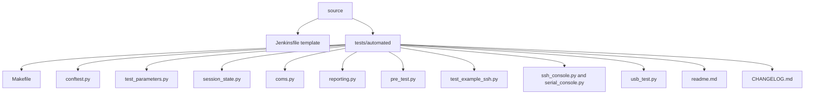
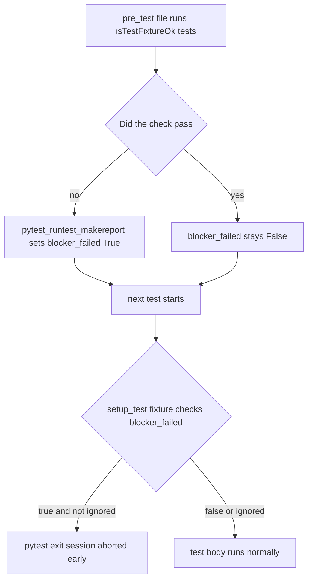

# HLDD 001 — Automated Test Scaffold

| Status | Date       | Project Version |
|--------|------------|-----------------|
| Draft  | 2026-07-11 | 0.0.1           |

## Summary

`source/tests/automated/` is a copyable pytest scaffold for embedded hardware-in-the-loop (HIL)
testing, plus a template `source/Jenkinsfile`. It is a starting point, not a runnable example: SSH
and serial transport code works out of the box, but there are no real feature tests until a
consuming project adds them. See `docs/adr/001-adopt-mos-docker-hil-test-suite-architecture.md`
for the decision and reasoning behind what was carried over, genericized, or dropped from its
source (`mos-docker/tests/automated`).

## Layout

## Module responsibilities

- **`test_parameters.py`** — static config, read once per session: CLI-mirrored defaults
  (`target_host`, `target_user`, `my_serial_port`), the `automated_test_version` string, and the
  shared `report_title` constant.
- **`session_state.py`** — mutable runtime state that changes *during* a session
  (`blocker_failed`, `ignore_blockers`, `test_marker_used`). Kept separate from
  `test_parameters.py` so "what was this suite told to do" never gets conflated with "what has
  happened so far this run."
- **`coms.py`** — the one place SSH (paramiko), SCP, serial, and ping/wait primitives live. Tests
  never call paramiko/pyserial directly; they call `coms.*`. `DOJO_SSH_PASSWORD` is the credential
  env var, read as a fallback by `coms.sshCreate()`.
- **`conftest.py`** — the pytest-plugin hub: CLI options and their mirror fixtures, the `ssh_client`
  connection-lifecycle fixture, the `step` narration fixture, the `isTestFixtureOk` blocker
  mechanism (a failed fixture-health test aborts the rest of the session), and the `pytest-html`
  report customization hooks.
- **`reporting.py`** — a dependency-light, pure-stdlib static HTML fallback report, independent of
  `pytest-html`'s JS-rendered table (which some CI systems' CSP settings block).
- **`pre_test.py`** — fixture health checks, marked `isTestFixtureOk`: importable dependencies,
  Python version, target reachability, and a changelog/version-sync check
  (`test_changelog_version_matches`).
- **`test_example_ssh.py`** — the worked example of "one test file per feature area": module-level
  `pytestmark`, the `ssh_client`/`step` fixtures, no hand-rolled connection management. Copy its
  shape for a real feature area, then delete it.
- **`ssh_console.py` / `serial_console.py` / `usb_test.py`** — human-facing debug tooling built on
  the same `coms.py` primitives the tests use: live-tail a service's journal over SSH, an
  interactive serial console, and USB-serial-number-based hardware autodetection.
- **`Makefile`** — the one command surface local dev and CI share (`sync`, `test`, `swtest`,
  `smoke`, `fixture`, `report`, `serial`, `ssh`, `clean`).
- **`Jenkinsfile`** (scaffold root, not under `tests/automated/`) — a template pipeline: Attestation
  (who triggered the build), Checkout, Setup, Fixture check, Feature tests, and `post{always{}}`
  JUnit publishing. Ships with placeholder tokens (agent label, credential IDs, repo URL) that must
  be filled in before it will run.

## Blocker mechanism

## Using this scaffold in a new project

1. Copy `source/tests/automated/` and `source/Jenkinsfile` into the new project.
2. Fill in `test_parameters.py`'s `target_host`/`target_user` defaults for the real target.
3. Fill in `usb_test.py`'s `known_hardware` dict if serial autodetection is needed.
4. Set `DOJO_SSH_PASSWORD` (or pass it per-invocation) rather than baking a credential into the repo.
5. Replace the `Jenkinsfile`'s placeholder tokens (`<AGENT_LABEL>`, `<SSH_PASSWORD_CREDENTIAL_ID>`,
   `<REPO_URL>`, `<REPO_BRANCH>`, `<REPO_CREDENTIAL_ID>`).
6. Delete `test_example_ssh.py` once real feature test files exist, following its shape (see
   `readme.md`'s "Adding a new test").
7. Bump `test_parameters.automated_test_version` and add a `CHANGELOG.md` entry for every
   substantive change from here on — `pre_test.py::test_changelog_version_matches` enforces the two
   stay in sync.
