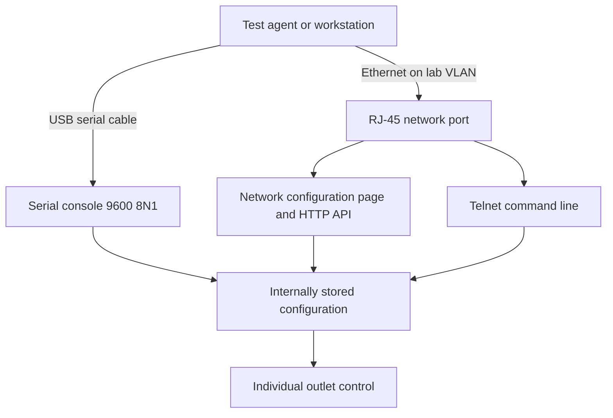
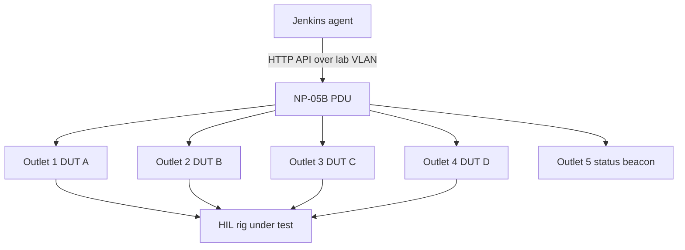
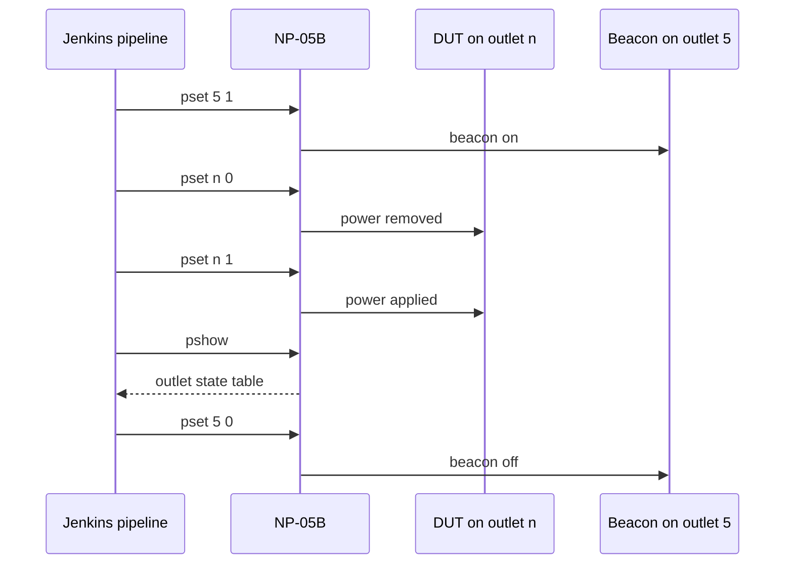
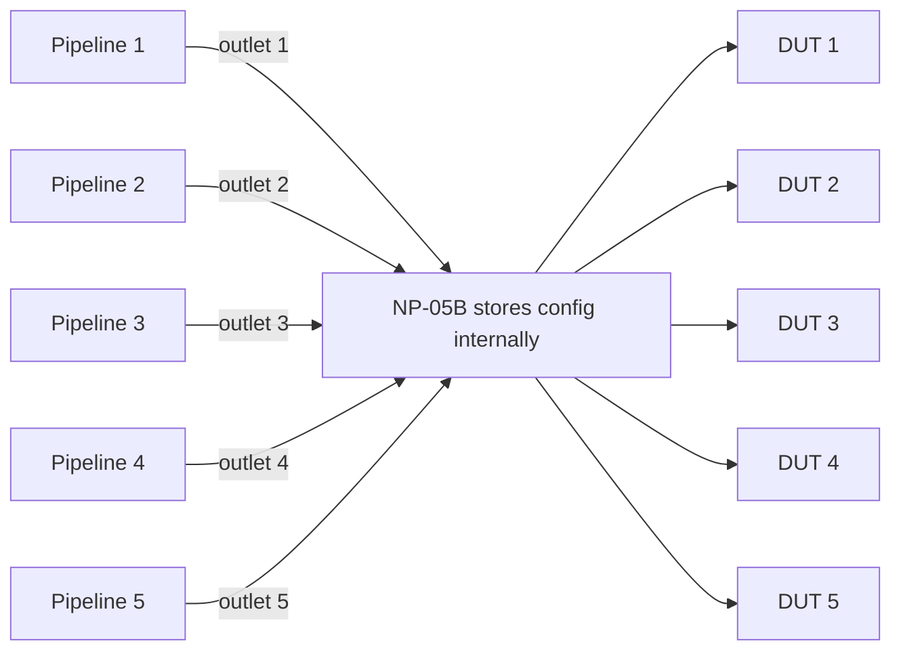

# Research 001 — Synaccess NP-05B as a Network-Controlled Power Outlet for HIL Testing

| Status   | Date       | Project Version |
|----------|------------|-----------------|
| Draft    | 2026-08-06 | 0.0.1           |

## Purpose

Evaluate the Synaccess netBooter NP-05B switched PDU as the remote power-control element for
hardware-in-the-loop (HIL) test rigs built on the scaffold in `source/tests/automated/` and the
template pipeline in `source/Jenkinsfile`.

Two things are documented here:

1. **A design case** in which outlet 5 drives a status beacon that indicates "test in progress",
   leaving outlets 1 through 4 for devices under test.
2. **The consequence of the unit storing its configuration internally** — outlet names, reboot
   duration, timers, network settings and user accounts persist in the PDU itself, so the PDU is
   not owned by any single host. That is what allows up to five independent HIL pipelines to share
   one unit.

This is a research document, not a decision. If the part is adopted, record that as an ADR under
`docs/adr/` and the rig design under `docs/hldd/`.

## Part Under Evaluation

| Attribute | Value |
|-----------|-------|
| Model | Synaccess netBooter NP-05B (`NP-05B-USB` variant on the cited listing) |
| Price | 299 USD, per the Amazon listing cited under References |
| Outlets | 5, individually switched |
| Inlet | IEC 320 C14 |
| Outlet receptacle | NEMA 5-15R |
| Voltage | 100-120V, 60Hz |
| Max input current | 15A, derated to 12A |
| Form factor | 1U strip, 19 in by 2.125 in by 1.75 in; 19 in rack brackets included |
| Network interface | 10 Base-T half duplex, RJ-45 |
| Protocols | HTTP API, HTTP web UI, Telnet, SNMP, SMTP, DHCP, NTP, BootP |
| Serial | USB (FTDI-based) or DB9 RS-232 depending on SKU, 2400 to 19200 baud |
| User accounts | Up to 3 local accounts, password protected |
| Front panel | Per-outlet on/off LEDs, plus PDU-power and network status LEDs |
| Current/temperature measurement | **None** on the B series — see Limitations |
| Overload protection | None |
| Operating temperature | -5C to 60C |
| Certifications | UL/CSA 62368-1 compliant, cTUVus listed, TAA compliant |
| Defaults | IP `192.168.1.100`, credentials `admin`/`admin` |

## Control Interfaces

The unit supports **two independent physical communication paths**, and both reach the same
internally stored configuration and the same command set:

1. **Serial over USB** — a direct local connection to the test agent, no network required.
2. **Local IP over Ethernet** — an RJ-45 network port with its own configurable IP address,
   administered through a built-in network configuration page.

Either path can configure the unit and switch individual outlets. Neither depends on the other,
which is the property that makes the unit recoverable: if the network settings are wrong or the
lab VLAN is down, the serial console still gets you in.



### Serial over USB

The B series ships in a USB variant (`NP-05B-USB`, FTDI-based) or a DB9 RS-232 variant
(`NP-05B-DB9`). The USB variant enumerates as a standard USB serial device on the test agent, so no
vendor driver or proprietary tooling is required.

| Serial parameter | Value |
|------------------|-------|
| Default baud | 9600 |
| Supported baud range | 2400 to 19200 |
| Data bits | 8 (7 or 8 supported) |
| Parity | None |
| Stop bits | 1 (1 or 2 supported) |
| Flow control | None |

The serial console exposes the **full** command line — the same `pset`, `rb`, `pshow` and `setup`
commands available over Telnet — so individual outlets can be switched over USB alone, with the
Ethernet port unplugged entirely.

Two consequences worth designing around:

- **A rig can run without putting the PDU on the network at all.** For a single-agent bench where
  the agent sits next to the rack, USB is simpler and removes the PDU from the network attack
  surface described under Limitations.
- **Serial is the recovery path.** Network configuration, including a lost or wrong static IP, is
  set from this console. Combined with the front-panel factory-reset button, a misconfigured unit
  is always recoverable without a bench visit from the vendor.

### Local IP over Ethernet, and the network configuration page

The Ethernet port is 10 Base-T half duplex, RJ-45. **DHCP is enabled by default**, with fallback to
a static address if no DHCP offer arrives; the assigned address is printed on the serial startup
banner. The factory static fallback is `192.168.1.100`.

The unit hosts its own **network configuration page**, reachable both as a web page and as the
equivalent terminal menu over serial or Telnet. It covers:

| Setting | Default |
|---------|---------|
| Obtain IP using DHCP | Y |
| Fallback to static IP if DHCP fails | Y |
| Static IP address | `192.168.1.100` |
| Subnet mask | `255.255.255.0` |
| Gateway IP address | `192.168.1.1` |
| Set DNS server manually, primary and secondary DNS | N, `0.0.0.0` |
| HTTP port number | 80 |
| Telnet port number | 23 |
| POP3 and SMTP ports and servers | 110, 25, undefined |
| Access Control List enable | N |
| Network connection check IP, for AutoPing | blank, gateway used |

Changes are committed with an explicit **Save**, and the menu notes that a system reboot is
required for changed network parameters to take effect. Because these settings are saved on the
unit, the PDU keeps its identity across power loss and across changes of controlling host.

For a multi-pipeline rig, assign the PDU a **static address or a DHCP reservation** rather than
leaving it on a dynamic lease. Five pipelines each hold the PDU address in their job
configuration, and a lease change would break all five at once.

### HTTP API

Basic authentication via an `Authorization: Basic` header. Commands are issued as HTTP GET:

```
http://<pdu-ip>/cmd.cgi?cmd=$Ax ARG1 ARG2
```

| Command | Arguments | Purpose |
|---------|-----------|---------|
| `$A3` | outlet number, state 0 or 1 | Set one outlet on or off |
| `$A4` | outlet number | Reboot one outlet |
| `$A5` | none | Read outlet states |
| `$A7` | state 0 or 1 | Set all outlets |

Responses are `$A0` for success and `$AF` for failure or unknown command. `$A5` returns a state
string in which the rightmost character is outlet 1, `1` meaning on. The current and temperature
fields documented for `$A5` are populated only on the netBooter DU series, not on this B series
unit.

### Command set, shared by Telnet and serial

One command set serves both transports — identical over Telnet and over the USB or DB9 serial
console, so a script written against one works against the other with only the transport swapped.
The commands relevant to automation:

| Command | Purpose |
|---------|---------|
| `pset n v` | Set outlet `n` to `v`, where 1 is on and 0 is off |
| `psetd n v s` | Set outlet `n` to `v` after a delay of `s` seconds |
| `ps v` | Set all outlets to `v` |
| `pshow` | Display outlet status table |
| `rb n` | Reboot outlet `n` |
| `rbd n s` | Reboot outlet `n` after a delay of `s` seconds |
| `rbt s` | Set reboot duration to `s` seconds, applies to all outlets, default 5 |
| `prsv n` | Reserve outlet `n` for the current login user |
| `punrsv n` | Release the reservation on outlet `n` |
| `pTmshow` | Display outlet timer settings |
| `sysshow`, `nwshow`, `ver` | System, network, and version information |

The manual explicitly calls out script-driven equipment test and control as an intended use of the
command line, which is the mode this research assumes.

### Web UI and physical override

A browser UI covers the same functions, and a front-panel switch allows manual per-outlet toggling
without any network connection — useful when the lab network is down but a technician is standing
at the rack.

## Python Control Script

Both transports are plain text protocols, so **a small Python script is sufficient to control
individual outlets** — no vendor SDK, no proprietary library, and no binary protocol to reverse.
The manual explicitly names script-driven equipment test and control as an intended use of the
command line.

**No new dependencies are required.** The HTTP path needs only `urllib` from the standard library,
and the serial path needs `pyserial`, which the scaffold already pins at `3.5` in
`source/tests/automated/pyproject.toml`.

The practical approach is one small class per transport behind a shared method signature, so a test
neither knows nor cares whether the outlet was switched over Ethernet or over USB. That also means a
bench can start on USB and later move to Ethernet without touching test code.

```python
'''
@brief  minimal NP-05B outlet control over either transport

        both classes expose the same three methods, so tests can be written
        against one and run against the other by swapping the constructor
'''
import base64
import urllib.request
import urllib.parse

import serial


class PduHttp:
    '''NP-05B over local IP ethernet, using the cmd.cgi HTTP API'''

    def __init__(self, host, user='admin', password='admin', timeout=5):
        self.host = host
        self.timeout = timeout
        token = base64.b64encode(f'{user}:{password}'.encode()).decode()
        self.headers = {'Authorization': f'Basic {token}'}

    def _cmd(self, command):
        url = f'http://{self.host}/cmd.cgi?cmd={urllib.parse.quote(command)}'
        request = urllib.request.Request(url, headers=self.headers)
        with urllib.request.urlopen(request, timeout=self.timeout) as response:
            body = response.read().decode(errors='replace').strip()
        if '$AF' in body:
            raise RuntimeError(f'PDU rejected command {command!r}: {body}')
        return body

    def set_outlet(self, outlet, on):
        '''switch a single outlet, leaving the other four untouched'''
        return self._cmd(f'$A3 {outlet} {1 if on else 0}')

    def reboot_outlet(self, outlet):
        '''off, dwell for the configured reboot duration, back on'''
        return self._cmd(f'$A4 {outlet}')

    def outlet_states(self):
        '''returns {outlet_number: bool}, outlet 1 is the rightmost character'''
        body = self._cmd('$A5')
        bits = body.replace('$A0', '').strip().strip(',').split(',')[0]
        return {i + 1: c == '1' for i, c in enumerate(reversed(bits))}


class PduSerial:
    '''NP-05B over the USB serial console, no network involved'''

    def __init__(self, port, baudrate=9600, user='admin', password='admin', timeout=2):
        # 9600 8N1, no flow control - the unit's factory default
        self.link = serial.Serial(port, baudrate, timeout=timeout)
        self._login(user, password)

    def _cmd(self, command):
        self.link.reset_input_buffer()
        self.link.write(f'{command}\r'.encode())
        # NOTE: framing a reply with read_until(b'>') does NOT work on this
        # hardware - see the caveats below. The shipped implementation in
        # source/tests/automated/power_control.py frames on quiescence instead.
        return self._read_reply()

    def _login(self, user, password):
        self._cmd('')
        self._cmd(f'login {user} {password}')

    def set_outlet(self, outlet, on):
        return self._cmd(f'pset {outlet} {1 if on else 0}')

    def reboot_outlet(self, outlet):
        return self._cmd(f'rb {outlet}')

    def outlet_states(self):
        '''parses the pshow table - see the caveat below'''
        return self._cmd('pshow')

    def close(self):
        self.link.close()
```

Usage is then transport-independent:

```python
pdu = PduHttp('192.168.1.100')          # or PduSerial('/dev/ttyUSB1')
pdu.set_outlet(1, False)                # cut power to DUT on outlet 1
pdu.set_outlet(1, True)                 # restore it
print(pdu.outlet_states())              # {1: True, 2: False, ...}
```

Wired into the scaffold, the natural shape is a fixture that follows the same create-yield-teardown
pattern as the existing `ssh_client` fixture, so an outlet is always restored to a known state even
when the test body fails:

```python
@pytest.fixture
def dut_power(request):
    pdu = PduHttp(test_parameters.power_host)
    outlet = test_parameters.power_outlet
    yield lambda on: pdu.set_outlet(outlet, on)
    pdu.set_outlet(outlet, True)        # never leave a DUT unpowered
```

The sketch above is illustrative. The shipped implementation is
`source/tests/automated/power_control.py`, which is importable from tests and runnable as a CLI.
Three caveats, all learned while building it:

- **Do not frame serial replies on the `>` character.** The unit prefixes banner and menu lines
  with `>`, so `read_until(b'>')` returns a fragment of the first line rather than the whole reply
  — against a real `pshow` table it stops inside the banner, before any outlet row appears. Frame
  on quiescence instead: treat a reply as complete once the device has been silent for a short gap.
- **Long serial output pages.** `pshow` ends a screen with `Press key "Enter" to continue ...` and
  the remaining outlet rows never arrive unless the reader answers the pager.
- **The serial console reports failure in prose, with no status code.** A rejected command looks
  identical to an accepted one, so a script that does not scan for error text will power-cycle
  nothing while still reporting success — the worst failure mode for a HIL rig. The HTTP transport
  does not share this problem; it returns `$AF`.

Also still unconfirmed against real hardware: the exact `$A5` field layout. The shared API
reference documents current and temperature fields that only DU series units populate, so the
returned field count may differ. Parse defensively, check that the parsed outlet count matches the
model, and pin the behaviour with a test.

Prefer the HTTP `$A5` path for status reads where both transports are available, and treat `pshow`
parsing as the fallback for serial-only benches.

## Design Case: Outlet 5 as a Test-In-Progress Beacon

Outlets 1 through 4 power devices under test. Outlet 5 powers a visible indicator that is switched
on for the duration of a test run, so anyone walking the lab can see at a glance that hardware is
mid-test and must not be touched, unplugged, or re-flashed.



Run sequence for a single pipeline driving DUT on outlet `n`:



### Beacon selection

The outlet is a **NEMA 5-15R delivering 120VAC**, not a logic-level output. The indicator must
therefore be a mains-powered device: a 120V panel indicator lamp, an LED work light, or an
industrial stack-light tower with a 120V input. A bare LED or a 5V indicator cannot be driven
directly from outlet 5 and would need its own mains adapter.

Two practical notes:

- Relay contacts switching a very small load are well within rating; there is no minimum-load
  concern for this application.
- Prefer an indicator that lights instantly on power-up. An incandescent or a lamp with a slow
  soft-start delays the visual signal relative to the actual test state.

### Beacon ownership across pipelines

Outlet 5 is a single shared resource. If more than one pipeline can run concurrently, "last one to
finish turns the beacon off" will switch the light off while another test is still running.
Options, in order of preference:

1. Have each pipeline turn the beacon **on** at start and, at teardown, turn it off **only if no
   other outlet-owning job holds a Jenkins lock**. This requires a shared lock and a small helper.
2. Accept the beacon as a coarse "the rig is busy" signal driven by a single supervising job rather
   than by each pipeline.
3. Reserve the beacon for a rig that runs one pipeline at a time, and use the PDU's own per-outlet
   front-panel LEDs for per-DUT state.

Option 3 is the simplest and is recommended for a first build, because the PDU already provides
per-outlet on/off LEDs on the front panel; outlet 5 then adds the one thing the front panel does
not convey, which is "a test is actively running" as distinct from "this outlet has power".

## Internal Configuration Storage and Five Independent Pipelines

The NP-05B holds its own configuration in non-volatile memory — network settings, outlet names,
reboot duration, per-outlet timers, AutoPing targets, and user accounts are all saved on the unit
via the setup menu's explicit **Save Settings** action, and survive power loss. A factory-default
reset switch behind the front panel restores shipping defaults.

This matters more than it first appears. Because the PDU carries its own state and exposes it over
the network, **no host owns it**. Any number of test controllers can address the same unit
concurrently, each touching only its own outlet. There is no driver to install, no USB cable
binding the PDU to one agent, and no daemon that must be running for the configuration to be
correct.

The consequence: **one NP-05B can back up to five individually controlled HIL test pipelines** —
five separate Jenkins jobs, each with its own target and its own outlet, each able to power-cycle
its DUT without disturbing the other four.



Note the trade-off with the design case above: **five DUT pipelines, or four DUT pipelines plus a
status beacon.** Outlet 5 cannot do both. Which configuration to build is a per-rig decision.

### Preventing cross-pipeline interference

Outlet naming makes the mapping self-documenting on the device itself: name outlet 1 for the DUT or
job it serves so that `pshow` and the web UI read meaningfully to anyone who opens them, rather
than requiring a wiki page to decode.

For enforcement, the PDU offers `prsv n` and `punrsv n`, which reserve an outlet for the logged-in
user and prevent other non-admin users from changing it. This is genuinely useful but **does not
scale to five pipelines**, because the unit supports only three local user accounts and an
administrator can override any reservation regardless.

Recommended approach: enforce ownership on the Jenkins side, where it scales, and treat `prsv` as
defence in depth if used at all.

- One Jenkins job per outlet, each retaining the template's `disableConcurrentBuilds()` so a single
  job cannot race itself.
- A per-outlet lockable resource so no other job can drive that outlet.
- Parameterise the outlet number alongside the existing `TARGET_HOST` parameter, so the job's
  target device and its power outlet are configured together in one place.

Because the outlet-to-DUT mapping lives in the PDU's own saved configuration and in each job's
parameters, adding a fifth rig is a wiring and job-cloning exercise, not a redesign.

## Applicability to Power-Related Test Types

| Test type | Supported by NP-05B | Notes |
|-----------|---------------------|-------|
| Power-down sequencing | Yes | `psetd n v s` gives per-outlet delayed switching, so multi-rail or multi-device shutdown ordering can be scripted directly. |
| Rapid power cycling | Yes | `pset` on/off pairs, or `rb` for a single reboot. This is the unit's core competency. |
| Endurance cycling, thousands of cycles | Yes | See Field Experience below. |
| Cold-boot and power-on-reset | Yes | Straightforward off, dwell, on. |
| Brown-out and voltage sag | **Partially — see below** | |
| Per-outlet current verification | **No** | The B series has no outlet or inlet measurement. |

### Brown-out testing, stated precisely

The NP-05B is a **relay-based on/off switch**. It cannot produce a reduced or ramped output
voltage, so it cannot generate a true brown-out where the rail sags to a partial voltage. A
programmable AC source or a variac is required for that.

What it does provide is **short-interruption testing**, which covers a substantial part of the same
risk surface: dropping the rail entirely for a brief window and confirming the DUT rides through or
resets cleanly. The constraint is the achievable minimum interruption:

- `rbt s` sets reboot duration in whole seconds with `s` greater than zero, so the shortest
  scripted reboot dwell is one second.
- Back-to-back `pset n 0` and `pset n 1` commands can produce a shorter interruption, but its
  length is set by command latency and relay actuation time and is **not deterministic or
  repeatable**. Treat any sub-second interruption obtained this way as uncharacterised unless it is
  measured on a scope.

If sub-second, repeatable sag profiles are a requirement, this part does not meet it and a
programmable AC source should be scoped instead. If the requirement is "remove power for a second
or more, thousands of times, unattended, over the network", this part meets it directly.

## Field Experience

Prior hands-on use of this unit in test automation, contributed by the author of this document:

- Power-down sequence tests — performed successfully.
- Brown-out tests — performed, within the interruption-based scope described above.
- Rapid power cycling — performed successfully.
- **Thousands of power cycles with no issues.** No relay failures, no stuck outlets, and no
  observed need to power-cycle or reset the PDU itself during those campaigns.

This is the strongest evidence in favour of the part. Relay endurance is the primary wear-out
mechanism for a switched PDU used this way, and it has been exercised heavily without failure.

Note that no formal relay cycle-life rating is published in the B series datasheet or user manual;
the above is field observation rather than a vendor specification.

## Limitations and Risks

| Item | Impact | Mitigation |
|------|--------|------------|
| No current or temperature measurement | Cannot confirm DUT draw or detect a DUT that failed to boot by power signature. Ruled out as a test assertion source. | Assert DUT state over SSH or serial using the existing scaffold, not via the PDU. Step up to a netBooter DU series unit if power telemetry becomes a requirement. |
| No encryption | HTTP Basic auth and Telnet send credentials in the clear. | Place the PDU on an isolated lab VLAN, not on a routable corporate network. Change the default `admin`/`admin` credentials on commissioning. For a single-agent bench, USB serial control avoids putting the PDU on the network at all. |
| Only 3 local user accounts | Per-pipeline PDU accounts do not scale to 5 outlets. | Enforce outlet ownership with Jenkins lockable resources, as described above. |
| Admin overrides any reservation | `prsv` is not a hard mutex. | Same as above. Do not rely on `prsv` alone. |
| No overload protection | An overcurrent condition is not handled by the unit. | Budget the 12A derated total across all five outlets and confirm the upstream circuit is appropriately protected. |
| 10 Base-T half duplex | Slow by modern standards. | Irrelevant for command-and-control traffic; it moves only short command strings. |
| Minimum scripted reboot dwell of 1 second | Insufficient for sub-second sag profiles. | Scope a programmable AC source if that requirement is real. |
| Single point of failure for the rig | A PDU failure blocks all five pipelines. | Accept for a lab rig, or hold a cold spare. Field experience above suggests low risk. |
| `$A5` current and temperature fields | Documented in the shared API reference but not populated on B series hardware. | Do not build assertions on those fields. |

## Integration Notes for This Repository

If adopted, the touch points in the existing scaffold would be:

- **`source/tests/automated/test_parameters.py`** — add the PDU address, credentials source, and
  the outlet number for this rig alongside the existing `target_host` and `target_user`.
- **`source/tests/automated/power_control.py`** — the `PduHttp` and `PduSerial` classes from the
  Python Control Script section above, as a module alongside the existing SSH and serial
  transports, importable from tests and runnable as a CLI. No new dependencies: `urllib` is stdlib
  and `pyserial` is already pinned. Named for the function rather than the device class because
  "PDU" collides with Protocol Data Unit in an embedded context.
- **`source/tests/automated/conftest.py`** — a power-cycle fixture, following the `ssh_client`
  fixture's create-yield-teardown pattern so an outlet is always restored to a known state even
  when a test fails.
- **`source/tests/automated/pyproject.toml`** — a new marker such as `powerCycle`, registered
  explicitly because `--strict-markers` is enabled.
- **`source/Jenkinsfile`** — a `PDU_OUTLET` parameter next to `TARGET_HOST`, a PDU credential ID in
  the `environment` block, and beacon-on / beacon-off steps if the design case above is built.

None of these have been implemented; they are scoped here only to size the work.

## Open Questions

1. Five DUT pipelines, or four plus a beacon? Decide per rig.
2. Is a repeatable sub-second sag profile actually required by any planned test? If yes, this part
   is insufficient on its own.
3. Which beacon hardware — panel lamp, work light, or stack-light tower?
4. USB or DB9 SKU? The serial console is a useful recovery path when the network configuration is
   lost; USB is the more convenient of the two on a modern test agent.
5. Confirm current pricing and lead time directly with the vendor before purchase; the 299 USD
   figure is from the Amazon listing and vendor-direct pricing was not reachable at the time of
   writing.

## References

- Amazon listing, Synaccess netBooter NP-05B — <https://www.amazon.com/Synaccess-NP-05B-Switched-Distribution-remotely/dp/B0039OZKPE>
- Synaccess netBooter B Series datasheet — <https://cdn.synaccess.com/documents/netBooter-B-Series-Datasheet.pdf>
- Synaccess HTTP API reference — <https://synaccess-pdus.readme.io/reference/http-api>
- Synaccess netBooter user manual, 46 pages, command list and setup menus — <https://zeus.phys.uconn.edu/wiki/images/NPUserMan.pdf>
- Synaccess B series product support — <https://synaccess.com/product-support/netbooter-b-series>
- `docs/hldd/001-automated-test-scaffold.md` — the HIL scaffold this would integrate with
- `docs/adr/001-adopt-mos-docker-hil-test-suite-architecture.md` — why that scaffold is shaped as it is
